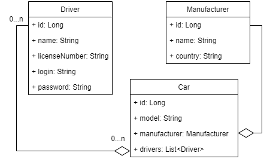

<h1 align="center">
🚕Taxi Service🚕
</h1> 

- <a href="#description">Description</a> 
- <a href="#features">Features</a> 
- <a href="#technologies">Technologies</a> 
- <a href="#how-to-run">How to run</a> 
- <a href="#diagram-of-relations-in-db">Diagram of relations in DB</a> 

## 📖Description📖
A simple web-based taxi service application. It maintains authentication, registration and other CRUD operations.
The program is written according to SOLID principles. And the Dependency Injection design pattern was used.

## ⚡Features
1️⃣Display all Drivers / Cars / Manufacturers 
2️⃣Display all Cars by Driver 
3️⃣Create new Driver / Car / Manufacturer 
4️⃣Add Driver to Car 
5️⃣Soft delete Driver / Car / Manufacturer 

## 💻Technologies
JDK 11 | Maven 4.0.0 | TomCat 9.0.50 | MySQL 8.0.22 | JDBC | Servlet 4.0.1 | JSTL 1.2 | JSP | HTML, CSS
## ▶How to run❓
1. Clone the project from GitHub✅
2. Use [`/resources/init_db.sql`](https://github.com/yehbreus/my-taxi-service/blob/main/src/main/resources/init_db.sql) to create a schema and tables✅
3. Configure [`/util/ConnectionUtil.java`](https://github.com/yehbreus/my-taxi-service/blob/main/src/main/java/taxi/util/ConnectionUtil.java#L9) with your own URL, username, password and JDBC driver✅
4. Configure Tomcat server (❗it is recommended to use [version 9.0.50](https://archive.apache.org/dist/tomcat/tomcat-9/v9.0.50/bin/)❗)✅
5. Run and enjoy the program✅

## 🔃Diagram of relations in DB

